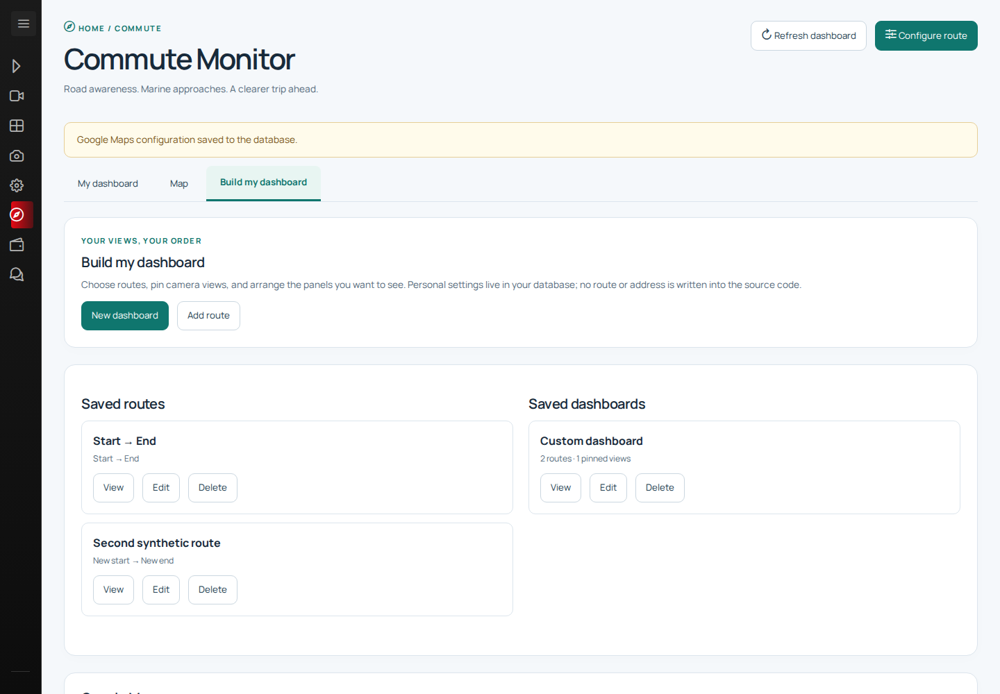
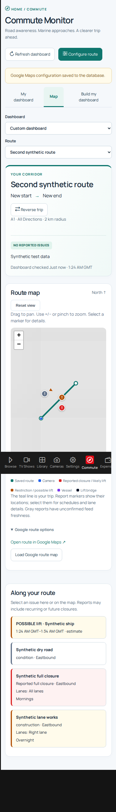

# HomeApp

A self-hosted home dashboard for media playback, AI chat, expenses and commute
monitoring. Angular 21 and PrimeNG provide the interface; ASP.NET Core 10 and
PostgreSQL store application data and settings. Optional Python services support
camera feeds and host-side VLC playback.

## Features

- Browse movie and TV libraries and control playback on a connected host.
- Configure OpenAI-compatible model endpoints and keep chat sessions in PostgreSQL.
- Capture expenses manually or from receipts, review imports and compare item prices.
- Save commute corridors and dashboards with traffic cameras, road reports, vessel
  positions and advisory lift-bridge estimates.
- Inspect metrics and traces with the optional monitoring stack.

Commute monitoring does not calculate driving time. Bridge estimates are
heuristics, and provider coverage can be incomplete. The
[financial platform design](docs/financial-platform-production-design.md) is a
proposal, not a list of implemented features.

## Screenshots

These screenshots use fictional routes and intercepted synthetic provider data.



<details>
<summary>Mobile layout</summary>



</details>

## Local development

Install Docker with Compose, .NET SDK 10 and Node.js 24 (or use the
[VS Code development container](.devcontainer/README.md)).

From the repository root:

```bash
cp .env.example .env
```

Edit `.env`: replace all password/token placeholders, set actual media/document
paths, and set `POSTGRES_CONNECTION` to use `Host=127.0.0.1`, the configured
`POSTGRES_PORT`, and the same database credentials as `POSTGRES_DB`,
`POSTGRES_USER` and `POSTGRES_PASSWORD`. Optional provider keys can stay absent.

```bash
docker compose --env-file .env up -d --wait postgres
dotnet run --project backend/Core/HomeApp.Host/HomeApp.Host.csproj \
  --urls http://localhost:5000
```

In another terminal:

```bash
cd frontend
npm ci
npm start
```

Open http://localhost:4200. The backend applies its schema migrations at startup.
Configure media folders and model endpoints in Settings. Commute starts without
any personal route or location; create a route in its dashboard builder.

## Validation

```bash
dotnet test backend/Core/HomeApp.sln --configuration Release
dotnet publish backend/Core/HomeApp.Host/HomeApp.Host.csproj \
  --configuration Release -p:UseAppHost=false --output /tmp/homeapp-publish
cd frontend
npm ci
npm audit
npm run build -- --configuration production
npm test -- --watch=false
npm run test:vessels
```

GitHub Actions runs dependency auditing, production builds and tests on pushes
and pull requests. The separate secret-scan workflow scans Git history. Dependabot
checks npm, NuGet, Docker, development containers and Actions updates weekly.

## Deployment and privacy

See [deployment instructions](DEPLOYMENT.md) and [Commute Monitor](docs/commute-monitor.md).
Docker publishes the app and administrative services on localhost by default.
Use SSH forwarding, a private VPN, or an authenticated reverse proxy for remote
access. `APP_BIND_IP` and `ADMIN_BIND_IP` are explicit overrides for deployments
that manage their own access restrictions.

The application uses a trusted-home-network model and has no built-in user login.
Do not expose it directly to the public internet. CORS does not authenticate API
requests. Personal routes, receipts, camera feeds, chat history and settings need
access protection and private backups.

Local environment files, credentials, runtime data and private SQL seeds are
excluded from Git and Docker build contexts. An optional port catalogue is
excluded from Git but intentionally bundled in the frontend when supplied locally;
use only data you intend to serve to your app users.

## Repository layout

| Directory | Purpose |
| --- | --- |
| `frontend` | Angular application and browser checks |
| `backend/Core` | ASP.NET modules, host and tests |
| `backend/Library` | Shared database and raster image infrastructure |
| `backend/PythonServices` | Optional camera and playback services |
| `scripts` | Image build, deployment and host setup helpers |
| `docs` | Module documentation and proposed designs |

## License

Project source is licensed under [MIT](LICENSE). Third-party packages and optional
media/catalogue data retain their own licenses.
