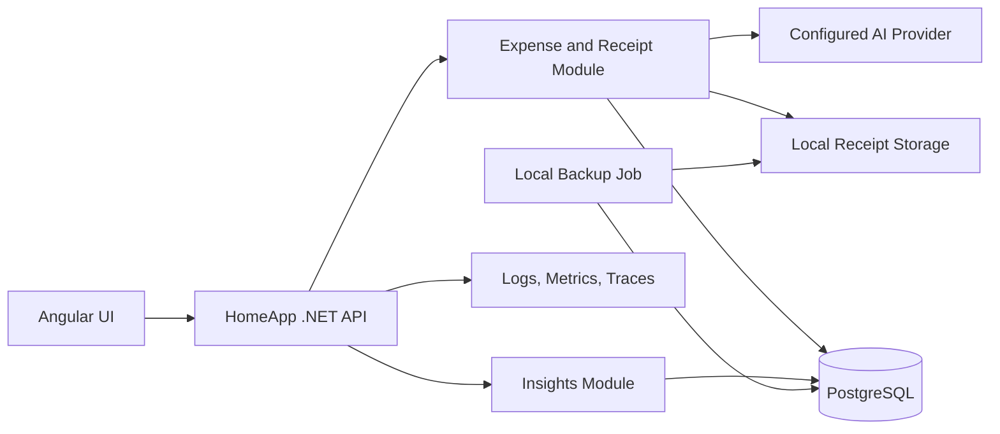

# HomeApp Local Financial Intelligence Server

## Product and Engineering Design

Status: Proposed
Audience: Maintainer, contributors, and portfolio reviewers
Deployment target: One private, local financial server
Repository target: Public GitHub portfolio project
Last updated: 2026-08-24

## 1. Product Vision

HomeApp is a private financial intelligence server for one person or household. It turns receipts and transaction imports into useful answers about spending:

- Where is the money going?
- Which costs are increasing?
- What recurring expenses can be reduced?
- Which store usually has the lowest comparable price for an item?
- What realistic action could save money this month?

The project is intentionally local-first. It is not a bank, accounting platform, financial adviser, payment processor, or internet-facing multi-tenant service. It does not move money or make decisions for the user.

The goal is a polished, trustworthy application that is useful every week and demonstrates professional product engineering in a public repository.

## 2. Scope

### 2.1 Deployment assumptions

- The application runs on a user-controlled computer or home server.
- The API, PostgreSQL database, receipts, and AI configuration remain on that server.
- The application is not directly exposed to the public internet.
- One financial dataset is shared by the local installation.
- Docker Compose is the primary deployment method.
- External AI providers may receive receipt images or text only when configured by the owner.

### 2.2 In scope

- Receipt scanning and structured extraction.
- Manual expense entry.
- CSV and transaction import.
- Expense and item classification.
- Product price history and store comparisons.
- Budgets, recurring-cost detection, spending trends, and savings insights.
- Corrections, duplicate prevention, reconciliation, and traceability.
- Local backups, data export, diagnostics, and safe upgrades.
- Professional documentation, automated tests, CI, and demo data.

### 2.3 Explicitly out of scope

- Public SaaS hosting or multi-tenant data isolation.
- Bank credential storage or automatic bank login.
- Payments, transfers, or automated purchasing.
- Tax filing, credit decisions, investing, or regulated financial advice.
- Enterprise identity, organization roles, or complex permission management.
- High-availability clusters and zero-downtime global infrastructure.
- Compliance claims intended for a commercial financial institution.

If the deployment scope later changes to internet-accessible or multi-user hosting, authentication, authorization, privacy, abuse prevention, and operational requirements must be redesigned before exposure.

## 3. What “Production Quality” Means Here

For this local application, production quality means:

1. It produces useful, explainable savings information.
2. It does not silently corrupt totals or create duplicate expenses.
3. AI output is validated before it affects financial insights.
4. Source receipts and user corrections remain traceable.
5. Data survives upgrades and can be backed up and restored.
6. Failures are visible and recoverable.
7. The repository can be cloned, configured, tested, and demonstrated by another developer.
8. No personal data, credentials, or private receipts are committed to GitHub.

This definition is deliberately proportional to a private local server. It prioritizes usefulness, data trust, maintainability, and presentation quality over enterprise infrastructure.

## 4. Current Foundation

HomeApp already includes:

- PostgreSQL persistence and EF Core migrations.
- Receipt image and receipt text analysis.
- Expense totals, category, date, merchant, location, and payment metadata.
- Item-level quantity, unit price, and line total extraction.
- Canonical item names and manual price-history merging.
- CSV and fetch-request imports.
- Basic duplicate fingerprints.
- Price Finder with store history.
- OpenTelemetry traces and Prometheus metrics.
- Docker Compose-oriented local deployment.
- Backend unit tests and an Angular production build.

The next work should convert those capabilities into a coherent money-saving experience before adding deeper infrastructure.

## 5. Guiding Principles

### Useful before impressive

Prioritize features that answer a real household question. A simple, accurate “you could save approximately $18 per month” card is more valuable than a complex dashboard without an action.

### AI proposes; code verifies

AI may read and classify a receipt. Deterministic code performs arithmetic, unit conversion, duplicate checks, budget calculations, and reconciliation.

### Preserve the evidence

Keep the original receipt label, image, imported row, and raw extraction. Corrections change the interpreted record without erasing the source.

### Compare like with like

Price Finder should compare normalized quantities and compatible units. A smaller package must not appear cheaper solely because its line total is lower.

### Explain every insight

Every recommendation identifies the records, time period, calculation, sample size, freshness, and assumptions behind it.

### Keep local operation simple

Prefer a well-structured modular monolith and PostgreSQL over unnecessary distributed services. Add a separate worker only when background processing materially improves reliability or responsiveness.

### Make corrections improve the system

A user correction should create a reusable alias or rule when appropriate, reducing future review work.

## 6. Target Architecture



### 6.1 Recommended deployment

Use Docker Compose with:

- `homeapp`: Angular static application, .NET API, and initially the background task host.
- `postgres`: financial and application data.
- Optional telemetry collector/dashboard for development and demonstrations.
- A bind-mounted or named volume for receipt files and backups.

The financial code remains a module with clear internal boundaries:

- Ingestion
- Receipt extraction
- Validation and reconciliation
- Duplicate detection
- Classification and canonical catalogs
- Expense ledger
- Insights
- Audit history

These boundaries should be represented by interfaces and services, not separate network services.

### 6.2 Background work

Receipt extraction should eventually run as a persisted background job so browser refreshes and model timeouts do not lose work. It can run inside the HomeApp process initially.

Required job properties:

- Persisted status and retry count.
- Idempotent processing.
- Bounded retries with a visible final failure.
- Correlation to the source receipt and generated expense.
- Safe recovery after an application restart.

## 7. Phased Delivery Roadmap

The phases are ordered by user usefulness first, then by the reliability and sophistication needed to sustain that usefulness. Each phase should produce a demonstrable release.

## Phase 1 — Useful Savings Experience

### Objective

Turn the existing tracker into something that helps the owner make a better spending decision immediately.

### User outcome

After importing transactions and scanning receipts, the user can open one financial home screen and understand:

- Current monthly spending.
- The categories and merchants driving it.
- Progress against simple budgets.
- Frequently purchased items and their observed store prices.
- A small number of concrete savings opportunities.

### Deliverables

#### Financial home screen

- Month-to-date spending.
- Previous-month comparison using the same elapsed-day window.
- Top category changes.
- Top merchant changes.
- Upcoming or recently charged recurring expenses.
- Three ranked insight cards at most.
- Visible data range and last refresh time.

#### Simple budgets

- Monthly overall budget.
- Optional category budgets.
- Actual, remaining, and projected month-end values.
- Clear handling of reimbursable and excluded expenses.
- Budget progress that links to the underlying transactions.

#### Immediately useful insights

Start with deterministic insights:

1. **Category increase:** “Dining is $84 higher than the same point last month.”
2. **Merchant concentration:** “You spent $126 at Store A across five visits.”
3. **Recurring increase:** “Internet increased from $65 to $72.”
4. **Product price difference:** “Cucumbers were last seen for $1.20 each at Store B versus $1.55 at Store A.”
5. **Avoidable fees:** “Three fees totaled $18 this month.”

Each card includes:

- Observation window.
- Baseline.
- Calculation details.
- Supporting expenses or items.
- Confidence/freshness label.
- Dismiss action.

#### Price Finder usefulness pass

- Search canonical product names and aliases.
- Show store, location, receipt date, package/quantity, and raw line total.
- Display comparable unit price when it can be calculated safely.
- Mark old prices as stale rather than presenting them as current.
- Separate exact comparisons from approximate alternatives.
- Retain merge/reclassification controls.

#### Monthly summary

- A concise monthly report designed for regular review.
- Total, category changes, recurring costs, unusual transactions, and estimated opportunities.
- Export to CSV and a printer-friendly view.

### Minimum safeguards in this phase

- Only accepted expenses contribute to insights.
- Every calculation uses decimal arithmetic.
- Unreconciled item totals are excluded from item-price conclusions.
- Comparisons across different currencies are disabled.
- Insights never claim guaranteed savings.

### Tests

- Unit tests for every insight calculation.
- Budget boundary and month-window tests.
- Price freshness and compatible-unit tests.
- API tests proving insight evidence matches returned totals.
- Angular tests for dashboard empty, loading, error, and populated states.

### Demo story

Load sanitized demo data, open the financial home, identify a growing category, drill into its transactions, then use Price Finder to find a cheaper store for a frequently purchased item.

### Exit criteria

- At least five deterministic insight types work from demo and real local data.
- Every insight links to supporting records.
- Budget totals match expense queries exactly.
- Price Finder never labels incompatible units as a direct comparison.
- A complete demo can be run from a fresh clone without personal data.

## Phase 2 — Trustworthy Financial Data

### Objective

Make the data reliable enough that the Phase 1 insights can be trusted.

### User outcome

The user knows which receipts were accepted, which require attention, why a value is uncertain, and whether a receipt already matches an imported transaction.

### Deliverables

#### Receipt reconciliation

Deterministically validate:

- `quantity × unit price` against line total.
- Item totals, discounts, deposits, and fees against subtotal.
- Subtotal, tax, and tip against receipt total.
- Currency and date plausibility.

Use explicit statuses:

- Reconciled
- ReconciledWithRounding
- NeedsReview
- NotItemized
- Rejected

Never invent an item to absorb an unexplained difference.

#### Review queue

Create a focused screen for:

- Low-confidence total, date, merchant, or category.
- Reconciliation failure.
- Unknown product.
- Possible duplicate.
- Unsupported currency or unit.

The receipt image and extracted values appear side by side. Approval and correction actions are explicit.

#### Strong duplicate prevention

Add idempotency and matching at three levels:

1. Identical upload content hash.
2. Identical imported source reference/row.
3. Probable match using amount, date, merchant, currency, and item similarity.

Probable matches require review. They are not silently deleted.

#### Receipt-to-statement linking

Allow a receipt and bank/card row to become two sources for one expense rather than two expenses. Support settlement-date differences and tips that change the final amount.

#### Corrections and history

- Track original and corrected values.
- Record when a correction was made and why.
- Allow undo for recent item merges and classification changes.
- Do not delete the source receipt when correcting an expense.

### Data additions

Add or formalize:

- `SourceDocument`: receipt/import metadata, content hash, local file reference.
- `ExtractionRun`: provider, model, prompt version, status, timestamps, raw response.
- `ExtractedField`: candidate value, confidence, evidence, validation status.
- `ReviewTask`: reason, status, resolution.
- `ExpenseSourceLink`: connects receipts and statement rows to one expense.
- `FinancialAuditEvent`: append-only interpretation changes.

### Tests

- Table-driven reconciliation tests covering tax, discounts, tips, weighted goods, deposits, and rounding.
- Idempotency tests proving retries create one record.
- Duplicate-scoring tests.
- Database tests for constraints and transactional receipt-to-statement linking.
- Migration tests using a copy of a representative schema.

### Demo story

Upload the same receipt twice, show that it is not duplicated, review one ambiguous item, link the receipt to a statement row, and display the audit history.

### Exit criteria

- Every receipt has a visible processing and reconciliation status.
- Repeated requests and job retries create zero duplicate expenses.
- Insights exclude rejected, superseded, or unresolved expenses.
- Corrections never erase original source evidence.

## Phase 3 — Consistent Classification and Fair Price Comparison

### Objective

Reduce manual cleanup and make item/store comparison accurate across naming and packaging differences.

### User outcome

The same merchant and product are classified consistently, and “cheapest” means cheapest for a genuinely comparable quantity.

### Deliverables

#### First-class product catalog

Promote the current canonical strings into explicit records:

```text
Product
- Id
- CanonicalName
- Brand
- Variant
- CategoryId
- DefaultComparisonUnit
- Status
- MergedIntoProductId
```

Keep `ProductAlias` records for:

- Receipt abbreviations.
- Case and punctuation variants.
- Merchant-specific labels.
- Barcodes when available.
- User-confirmed AI matches.

#### Merchant catalog

- Canonical merchant and optional store location.
- Aliases for statement descriptions and receipt headers.
- Store number/address when confidently available.
- Merchant-specific product aliases.

#### Unit and package normalization

Support dimensions:

- Count
- Mass
- Volume

Convert only within the same dimension. Keep these values separately:

- Price as sold.
- Package size.
- Comparable quantity and unit.
- Comparable unit price.

Never guess a count-to-weight conversion.

#### Classification precedence

1. User-confirmed alias.
2. Barcode match.
3. Exact normalized alias.
4. Deterministic local rule.
5. High-confidence similarity match.
6. AI suggestion constrained to relevant existing products.
7. New product requiring confirmation.

#### Catalog management

- Merge products.
- Split selected purchases from a product.
- Reclassify one purchase or all matching aliases.
- Add a merchant-specific alias.
- Undo merge/split.
- Archive unused catalog entries.

### AI prompt strategy

Do not place an unlimited product list in every prompt. Select a small relevant vocabulary from OCR tokens, merchant history, and similarity search. Instruct the model to reuse an exact catalog name when appropriate and to return a new-product candidate otherwise.

Record model ID, prompt version, and catalog candidates for each decision.

### Tests and evaluation

- Build a sanitized receipt evaluation set.
- Measure merchant, category, and product top-1 accuracy.
- Measure auto-classification coverage separately from accuracy.
- Add normalization idempotence and alias-collision tests.
- Add unit-conversion property tests.
- Require evaluation results not to regress before changing models or prompts.

Suggested initial targets:

| Metric | Target |
|---|---:|
| Receipt total accuracy | >= 99.5% |
| Currency accuracy | >= 99.9% |
| Merchant canonical accuracy | >= 97% |
| Readable line-total accuracy | >= 97% |
| Product canonical accuracy | >= 93% |
| Auto-accepted reconciliation failures | < 0.1% |

Targets should be recalibrated after measuring real local receipts. Publish accuracy and coverage together in repository documentation.

### Demo story

Show several differently formatted receipt labels resolving to one product, compare package-normalized prices, then split an incorrectly merged variant and undo the operation.

### Exit criteria

- Canonical corrections influence future scans.
- Product merge and split operations are reversible.
- Direct price comparisons use compatible normalized units.
- Classifier evaluation runs automatically and reports accuracy plus coverage.

## Phase 4 — Deeper Financial Insights

### Objective

Build richer guidance after the underlying data and classifications are dependable.

### User outcome

The server highlights meaningful long-term patterns and estimates savings without overwhelming the user or overstating confidence.

### Deliverables

#### Recurring expense detection

- Detect merchant, amount range, and cadence patterns.
- Label results as confirmed or probable.
- Detect price increases and missing expected charges.
- Let the user mark a recurrence as subscription, bill, income, or false match.

#### Spending trends

- Rolling three-, six-, and twelve-month comparisons.
- Fixed versus variable and discretionary spending.
- Seasonal baseline where enough history exists.
- Category and merchant contribution to change.

#### Unusual-spending detection

- Identify unusual amount, frequency, merchant, or category behavior.
- Explain what caused the flag.
- Use calm language and visible confidence.
- Allow dismissal and feedback.

#### Shopping basket opportunities

- Estimate savings using products actually purchased.
- Account for quantity, price freshness, and known membership/delivery costs.
- Avoid recommending extra trips when estimated savings are below a configurable threshold.
- Report gross and estimated net savings separately.

#### Insight lifecycle

Persist:

- Insight type and algorithm version.
- Observation window and baseline.
- Supporting expense/item IDs.
- Estimated saving and assumptions.
- Confidence and expiration.
- Viewed, useful, dismissed, or acted-on feedback.

AI may summarize deterministic results in natural language. It must not generate the underlying financial calculations.

### Tests

- Golden tests for every algorithm version.
- Time-window and seasonal boundary tests.
- Sparse-data and outlier tests.
- Evidence integrity tests.
- False-positive review using demo and consented local data.

### Demo story

Open a yearly trend, identify a recurring bill increase, inspect the exact evidence, and compare an estimated shopping change with its assumptions and net saving.

### Exit criteria

- Every insight is reproducible from stored evidence.
- Stale insights expire automatically.
- User feedback is captured and visible in diagnostics.
- AI-generated wording cannot change calculated amounts.

## Phase 5 — Professional Local Product and Public Repository

### Objective

Make the application dependable to operate locally and impressive, safe, and understandable as a public engineering portfolio.

### User outcome

The owner can install, upgrade, diagnose, back up, restore, export, and demonstrate HomeApp confidently.

### Local operational quality

#### Installation and configuration

- One documented Docker Compose startup path.
- `.env.example` containing safe placeholders and explanations.
- Startup validation with actionable missing-setting errors.
- Health checks for API, database, receipt storage, and AI configuration.
- Version displayed in the UI and diagnostics.

#### Backup and restore

- Command/script to back up PostgreSQL and receipt files together.
- Timestamped encrypted backup option.
- Retention configuration.
- Restore command with confirmation and validation.
- Automated restore test in CI where practical and periodic manual local exercise.

#### Upgrade safety

- Reviewed EF migration SQL.
- Database backup recommendation before upgrade.
- Production/local-server startup fails clearly on migration failure.
- Long data backfills run as resumable tasks rather than hidden startup work.
- Release notes include migration and rollback considerations.

#### Diagnostics

- Structured, redacted logs.
- Correlation IDs for receipt processing.
- Metrics for extraction failure, reconciliation, review backlog, duplicates, and insight generation.
- Diagnostics page that never exposes secrets or full receipt text.
- Clear degraded mode when the AI provider is unavailable.

### Local security and privacy

Because the server is private and not internet-facing, security should remain practical:

- Bind to localhost by default; document the explicit setting needed for LAN access.
- If LAN access is enabled, support a simple local login or access token and recommend TLS through a local reverse proxy/VPN.
- Never expose PostgreSQL or metrics beyond the intended local network.
- Keep secrets in environment/deployment files excluded by Git.
- Redact receipt text, payment identifiers, connection strings, and AI keys from logs.
- Strip image metadata and enforce file size/type limits.
- Store no complete card numbers or security codes.
- Provide receipt retention and complete local export/delete controls.
- Document which configured AI provider receives receipt content.

### Public GitHub repository quality

#### Root README

The README should answer within one page:

- What HomeApp does.
- Why it exists.
- Main financial features.
- Local-only/privacy model.
- Architecture diagram.
- Screenshots or a short sanitized GIF.
- Quick start.
- Test commands.
- Roadmap status.
- Technology choices.

#### Safe demo mode

- Sanitized deterministic seed data.
- Synthetic receipt fixtures with no real names, addresses, account numbers, or purchases.
- One command to reset and load demo data.
- Demo screenshots generated only from synthetic data.
- CI check or documented review preventing accidental fixture secrets.

#### Engineering documentation

- This design document.
- Short Architecture Decision Records for important choices.
- API/OpenAPI documentation.
- Database/model overview.
- Receipt-classifier evaluation methodology and results.
- Backup/restore guide.
- Troubleshooting guide.
- Security and privacy statement appropriate to local-only software.

#### Repository hygiene

- License selected and included.
- `CONTRIBUTING.md` and code-of-conduct decision documented.
- Issue and pull-request templates.
- Consistent formatting and lint rules.
- Conventional or clearly documented commit/release process.
- Semantic version tags and human-readable release notes.
- No generated `bin`, `obj`, Angular cache, local database, receipt, backup, or secret files tracked.

#### CI pipeline

For every pull request:

- Restore dependencies.
- Build backend and frontend.
- Run backend, frontend, and integration tests.
- Validate formatting.
- Validate EF migrations.
- Scan committed content for secrets.
- Run dependency vulnerability scanning.
- Optionally build the container as a final packaging check.

Known dependency advisories reported by the current build should be resolved or documented with a narrowly scoped, time-bounded explanation before presenting a stable release.

### Portfolio demonstration

The repository should make these engineering qualities visible:

- A product problem tied to measurable user value.
- AI used behind deterministic validation rather than treated as infallible.
- Thoughtful financial data modeling.
- Idempotency and duplicate handling.
- Explainable insight calculations.
- Versioned migrations and automated tests.
- Local-first privacy decisions.
- Screenshots and a repeatable demo path.

### Exit criteria

- Fresh clone to demo takes no more than ten documented minutes after prerequisites.
- CI is green on the default branch.
- Demo mode contains no personal information.
- Backup and restore have been successfully exercised.
- Repository documentation accurately reflects implemented versus planned features.
- Stable release has a version tag, release notes, screenshots, and known-limitations section.

## 8. Data Model Direction

The model should evolve incrementally rather than be replaced all at once.

### Source and extraction

#### SourceDocument

- `Id`
- `SourceType`: ReceiptImage, ReceiptText, Csv, Fetch, Manual
- `ContentHashSha256`
- `LocalStoragePath`
- `OriginalFileName`, `ContentType`, `ByteLength`
- `CapturedAtUtc`, `CreatedAtUtc`
- `IdempotencyKey`

#### ExtractionRun

- `Id`, `SourceDocumentId`
- `Provider`, `ModelId`, `PromptVersion`
- `StartedAtUtc`, `CompletedAtUtc`, `Status`
- `RawResponseJson`
- `ErrorCode`, `RetryCount`

#### ExtractedField

- `ExtractionRunId`
- `EntityType`, `EntityTemporaryId`, `FieldName`
- `CandidateValueJson`
- `Confidence`
- `EvidenceText` or receipt bounding box
- `ValidationStatus`, `ValidationMessage`

### Expense ledger

Extend `ExpenseEntry` with:

- `SourceDocumentId`
- `Status`: Pending, Accepted, NeedsReview, Rejected, Superseded
- `ReconciliationStatus`
- `Version`
- `IdempotencyKey`
- `SupersedesExpenseId`

Extend `ExpenseLineItem` with:

- `ProductId`
- `ReceiptLabel`
- `Quantity`, `QuantityUnitId`
- `PackageQuantity`, `PackageUnitId`
- `LineSubtotal`, `DiscountAmount`, `TaxAmount`, `LineTotal`
- `ComparableQuantity`, `ComparableUnitId`, `ComparableUnitPrice`
- `Confidence`, `ReviewStatus`

Keep receipt adjustments separate from products:

- Discount
- Coupon
- Tax
- Tip
- Deposit
- Fee
- Rounding

### Catalogs

- `Product`
- `ProductAlias`
- `Merchant`
- `MerchantAlias`
- `MerchantLocation`
- `UnitDefinition`
- `ExpenseCategory`

### Insight records

- `Budget`
- `RecurringExpensePattern`
- `Insight`
- `InsightEvidence`
- `InsightFeedback`

### Audit

`FinancialAuditEvent` records:

- Actor: LocalUser, AI, Rule, Migration
- Action and reason.
- Entity type and ID.
- Before and after interpreted values.
- Model/rule version where relevant.
- Correlation ID and timestamp.

Audit history must not duplicate receipt images, secrets, or unnecessary sensitive raw text.

## 9. Receipt Processing Design

### Processing states

```text
Uploaded
  -> Queued
  -> Extracting
  -> Validating
  -> Accepted
       or NeedsReview
       or Duplicate
       or FailedRetryable
       or FailedPermanent
```

### Extraction contract

The AI returns candidates:

- Merchant and location.
- Date and currency.
- Subtotal, discounts, fees, tax, tip, and total.
- Line-item receipt label, canonical suggestion, quantity, unit, unit price, and total.
- Per-field confidence.
- Unreadable or ambiguous fields.

The server then:

1. Validates the JSON schema.
2. Recalculates arithmetic.
3. Resolves deterministic aliases.
4. Reconciles items and totals.
5. Checks duplicates.
6. Accepts the result or creates review tasks.

### Acceptance policy

Automatically accept only when:

- Total, currency, and date are valid.
- No exact duplicate exists.
- Required confidence thresholds are met.
- Reconciliation succeeds or the receipt is explicitly non-itemized.
- No plausibility rule is triggered.

An expense total and its line-item analytics can have separate completeness states. A valid expense may be accepted while uncertain line items remain excluded from Price Finder.

## 10. Insights Calculation Contract

An insight algorithm receives accepted expenses and returns:

- Type and algorithm version.
- Title and concise explanation.
- Observation and comparison windows.
- Calculated amount and currency.
- Estimated saving when applicable.
- Confidence and freshness.
- Supporting expense/item IDs.
- Structured calculation details.
- Expiration date.

The amount must be reproducible without an AI model. If AI rewrites the explanation, the numeric result and evidence remain unchanged.

### Savings estimates

Store and show:

- Current behavior baseline.
- Proposed alternative.
- Comparable quantity.
- Observation age and sample size.
- Gross estimated saving.
- Known additional costs.
- Net estimated saving.
- Assumptions and confidence.

One old price observation should be labeled as historical evidence, not a current guaranteed offer.

## 11. Testing Strategy

### Unit tests

- Monetary rounding and reconciliation.
- Unit conversion and compatibility.
- Product normalization and alias precedence.
- Duplicate fingerprints and match scoring.
- Budgets, time windows, trends, recurrence, and savings algorithms.
- Insight evidence generation.

### Integration tests

- PostgreSQL constraints and transactions.
- EF migration upgrade path.
- Idempotent receipt/import ingestion.
- Receipt-to-statement linking.
- Product merge, split, and undo.
- Background-job retries and restart recovery.

### API tests

- Validation and problem responses.
- Pagination/filtering.
- Optimistic concurrency for edits.
- Upload limits and unsupported files.
- Evidence totals matching dashboard totals.

### Browser tests

- Receipt upload and progress.
- Review and correction.
- Duplicate resolution.
- Price comparison and reclassification.
- Budget creation and drilldown.
- Insight evidence and dismissal.
- Empty, loading, degraded, and error states.

### Evaluation tests

Use synthetic or consented/redacted receipts covering:

- Multiple layouts.
- Blur, skew, glare, and cropping.
- Discounts, returns, tips, fees, tax, and deposits.
- Weighted produce and package quantities.
- Multiple date and currency formats.
- Similar product names and merchant aliases.

Keep evaluation fixtures out of application seed data and document their provenance.

## 12. Local Reliability and Privacy Checklist

- [ ] Application binds to localhost by default.
- [ ] LAN exposure is explicit and documented.
- [ ] PostgreSQL and metrics are not broadly exposed.
- [ ] Secrets and personal files are excluded from Git.
- [ ] Logs and traces are checked for receipt/payment data leakage.
- [ ] Receipt uploads have content, size, and image-safety validation.
- [ ] AI data-sharing behavior is documented.
- [ ] Database and receipt files are backed up together.
- [ ] Restore procedure has been tested.
- [ ] Migration failures are visible and stop unsafe startup.
- [ ] Repeated requests cannot create duplicate expenses.
- [ ] Accepted receipt totals pass deterministic validation.
- [ ] Insights link to their evidence and calculation.
- [ ] Export and deletion tools cover the complete local dataset.

## 13. Public Repository Checklist

- [ ] Root README presents the product, screenshots, architecture, and quick start.
- [ ] Local-only scope and AI privacy behavior are explicit.
- [ ] `.env.example` contains placeholders only.
- [ ] Demo mode uses entirely synthetic data.
- [ ] CI builds and tests backend/frontend changes.
- [ ] Secret and dependency scanning run automatically.
- [ ] Generated artifacts, receipts, backups, and local databases are ignored.
- [ ] License and contribution expectations are documented.
- [ ] Architecture decisions and planned phases are visible.
- [ ] Implemented features are clearly separated from roadmap items.
- [ ] Releases use versions and readable notes.
- [ ] Known limitations and dependency advisories are honest and current.

## 14. Priority Summary

| Priority | Phase | Primary value |
|---:|---|---|
| 1 | Useful Savings Experience | Makes the application valuable in regular use |
| 2 | Trustworthy Financial Data | Makes the answers dependable |
| 3 | Consistent Classification | Makes price comparisons fair and reduces cleanup |
| 4 | Deeper Financial Insights | Finds longer-term saving opportunities |
| 5 | Professional Local Product and Repository | Makes operation reliable and the work easy to evaluate |

The first implementation task should be the Phase 1 financial home and deterministic insight contracts. Build it using the current accepted expense data, include the minimum safeguards listed in Phase 1, and use its real data requirements to guide the Phase 2 ingestion improvements.
